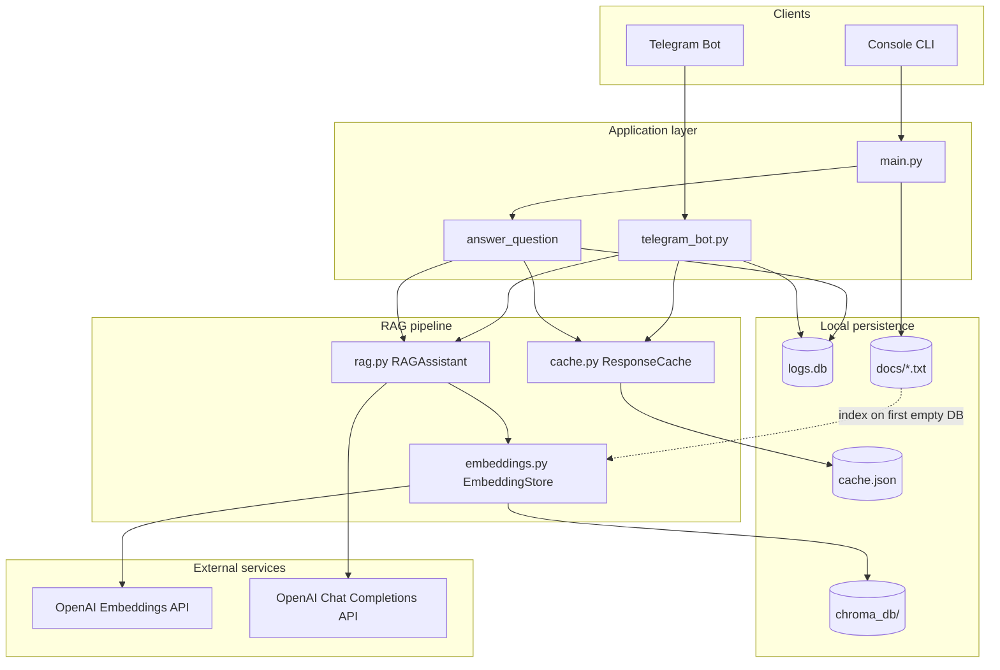
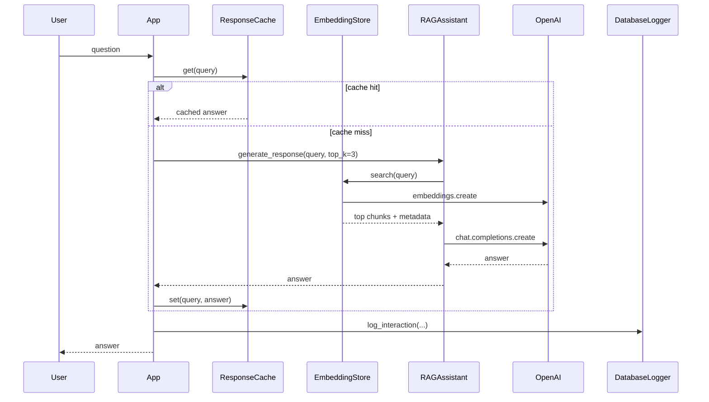

# Architecture

This document describes the system design of the **Пардус-Р RAG assistant**: a Russian-language retrieval-augmented generation (RAG) application that answers questions about the portable X-ray device «Пардус-Р» using a local knowledge base, OpenAI APIs, and optional Telegram delivery.

## Goals and scope

| Goal | How it is met |
|------|----------------|
| Ground answers in product documentation | Semantic search over chunked `.txt` files in `docs/` |
| Reduce API cost and latency | SHA-256–keyed response cache (`cache.json`) |
| Audit usage | SQLite interaction log (`logs.db`) |
| Multiple entry points | Console (interactive/demo) and Telegram bot |

The system is intentionally **monolithic**: a single Python process wires components together in `main.py`. There is no separate API server, queue, or orchestration layer in the current codebase.

## High-level diagram

## Request lifecycle

Every user question follows the same logical path (console via `answer_question()`, Telegram via `TelegramRAGBot.handle_message()`):

1. **Normalize and hash** the query (`ResponseCache._get_cache_key()` — lowercase, collapsed whitespace, SHA-256).
2. **Cache lookup** — on hit, return stored answer and skip retrieval/LLM.
3. **Retrieval** — embed the query with OpenAI `text-embedding-3-small`, query ChromaDB for `top_k=3` chunks (default).
4. **Generation** — build a Russian prompt with retrieved context; call `gpt-3.5-turbo` (`max_tokens=500`, `temperature=0.7`).
5. **Cache write** — persist the new answer to `cache.json`.
6. **Logging** — insert row into `logs` with source (`console` / `telegram`), optional `user_id`/`username`, `from_cache`, and `response_time_ms`.

## Module responsibilities

| Module | Role | Key types / artifacts |
|--------|------|------------------------|
| `main.py` | Entry point, bootstrapping, mode selection, shared `answer_question()` | `initialize_system()`, interactive/demo/Telegram modes |
| `embeddings.py` | Document ingestion, chunking, embedding, ChromaDB CRUD and search | `EmbeddingStore`, `load_documents_from_folder()`, `get_sample_documents()` |
| `rag.py` | Prompt construction and LLM completion | `RAGAssistant` |
| `cache.py` | Durable in-memory cache backed by JSON | `ResponseCache` |
| `db_logger.py` | Interaction audit trail and CSV export | `DatabaseLogger`, table `logs` |
| `telegram_bot.py` | Async Telegram handlers (commands + free text) | `TelegramRAGBot` |
| `vector_store.py` | Thin facade over `EmbeddingStore` | `VectorStore` — **not used** by `main.py` today |

### Boot sequence (`initialize_system`)

On startup, `main.py`:

1. Loads `.env` via `python-dotenv`.
2. Creates `ResponseCache("cache.json")`.
3. Creates `EmbeddingStore` with collection `rag_documents`, persist path `./chroma_db`, model `text-embedding-3-small`.
4. If Chroma collection count is **0**, loads documents via `get_sample_documents()` (prefers `docs/*.txt`, else built-in Python/ML sample texts).
5. Instantiates `RAGAssistant` with `gpt-3.5-turbo`.
6. Opens `DatabaseLogger("logs.db")`.

Indexing is **one-time per empty vector store**; adding files under `docs/` later does not automatically re-index without clearing `chroma_db/` or calling `clear_collection()` and re-running.

## Data layer

### Knowledge base (`docs/`)

Eight UTF-8 `.txt` files cover product capabilities, safety, specifications, kit contents, registration (КТРУ), and usage examples for «Пардус-Р». Filenames (stem) become the `source` metadata on each chunk.

### Chunking and embeddings

- **Chunk size**: 500 characters, **overlap**: 50 characters (character-based, not token-based).
- **Embedding model**: `text-embedding-3-small` (OpenAI), batches of up to 100 texts per API call.
- **Storage**: ChromaDB `PersistentClient` at `./chroma_db`, telemetry disabled.
- **IDs**: sequential `chunk_{n}`; re-ingestion after partial deletes can collide unless collection is cleared.

### ChromaDB query

Search uses **manual embeddings** (not Chroma’s built-in embedding function): query text → OpenAI embedding → `collection.query(query_embeddings=..., n_results=top_k)`. Results are `(chunk_text, source, distance)` where lower distance means closer match in embedding space.

### Response cache

- File: `cache.json` (map of hash → answer string).
- Keys are **not** the raw query text; identical meaning with different spacing/casing still hits cache after normalization.

### Logs schema (`logs.db`)

| Column | Purpose |
|--------|---------|
| `timestamp` | ISO time of interaction |
| `user_id`, `username` | Telegram identity when applicable |
| `source` | `console` or `telegram` |
| `query`, `response` | Full text (PII-sensitive) |
| `from_cache` | 0/1 |
| `response_time_ms` | End-to-end latency |

Indexes exist on `timestamp`, `user_id`, and `source`.

## External dependencies

| Service | Usage |
|---------|--------|
| OpenAI Embeddings | Indexing and query vectors |
| OpenAI Chat Completions | Final answer generation |
| Telegram Bot API | Optional user channel (`python-telegram-bot` v20+, async polling) |

### SQLite compatibility shim

`embeddings.py` and `db_logger.py` import `pysqlite3` and replace `sys.modules["sqlite3"]` before ChromaDB/SQLite use. This avoids older system SQLite builds breaking Chroma. **`pysqlite3` is not listed in `requirements.txt`** — production installs should add it explicitly (see [DEPLOYMENT.md](./DEPLOYMENT.md)).

## Runtime modes

| Mode | Trigger | Behavior |
|------|---------|----------|
| Interactive | `main.py` → `1` | REPL: questions, `cache`, `clear_cache`, `stats`, `logs` |
| Demo | `main.py` → `2` | Fixed question set; optional transition to interactive |
| Telegram | `main.py` → `3` if `TELEGRAM_BOT_TOKEN` set | Long-polling bot; `/start`, `/help`; hidden `/stats`, `/logs` |

Telegram splits answers longer than 4000 characters and appends a “from cache” hint when applicable.

## Configuration surface

| Variable | Required | Wired in code |
|----------|----------|---------------|
| `OPENAI_API_KEY` | Yes (for RAG) | Yes — `EmbeddingStore`, `RAGAssistant` |
| `TELEGRAM_BOT_TOKEN` | For Telegram mode | Yes — enables menu option 3 |
| `MODEL_NAME`, `TEMPERATURE`, `EMBEDDING_MODEL`, etc. | No | Documented in `env.example` only; **hardcoded** in `main.py` / `EmbeddingStore` defaults |

## Security and operational notes

- Secrets live in `.env` (gitignored); never commit API keys or bot tokens.
- Logs and CSV exports may contain **full user questions and model answers** — treat exports as confidential.
- There is no authentication on console mode; Telegram exposes `/stats` and `/logs` to any user who knows the commands (they are omitted from `/help`).
- No rate limiting, content moderation, or prompt-injection hardening beyond a static system/user prompt in Russian.

## Extension points

Reasonable evolution paths (see [ROADMAP.md](./ROADMAP.md)) without rewriting the core:

- Wire `env.example` optional variables into `initialize_system()`.
- Use `VectorStore` or drop it to avoid duplication.
- Extract `answer_question()` logic for reuse by a future FastAPI layer.
- Add a CLI/admin command to re-index `docs/` without deleting the whole `chroma_db/` directory.
- Replace file cache with Redis for multi-instance Telegram deployments.

## Technology stack summary

- **Language**: Python 3.11+
- **RAG**: ChromaDB + OpenAI embeddings + OpenAI chat
- **Bot**: `python-telegram-bot` (async)
- **Config**: `python-dotenv`
- **Persistence**: local filesystem + SQLite

For install and run instructions, see [DEPLOYMENT.md](./DEPLOYMENT.md). For planned improvements, see [ROADMAP.md](./ROADMAP.md).
