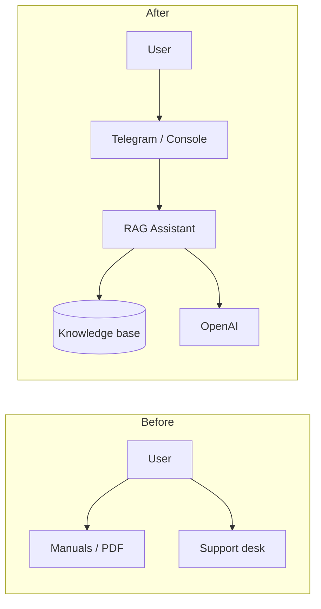
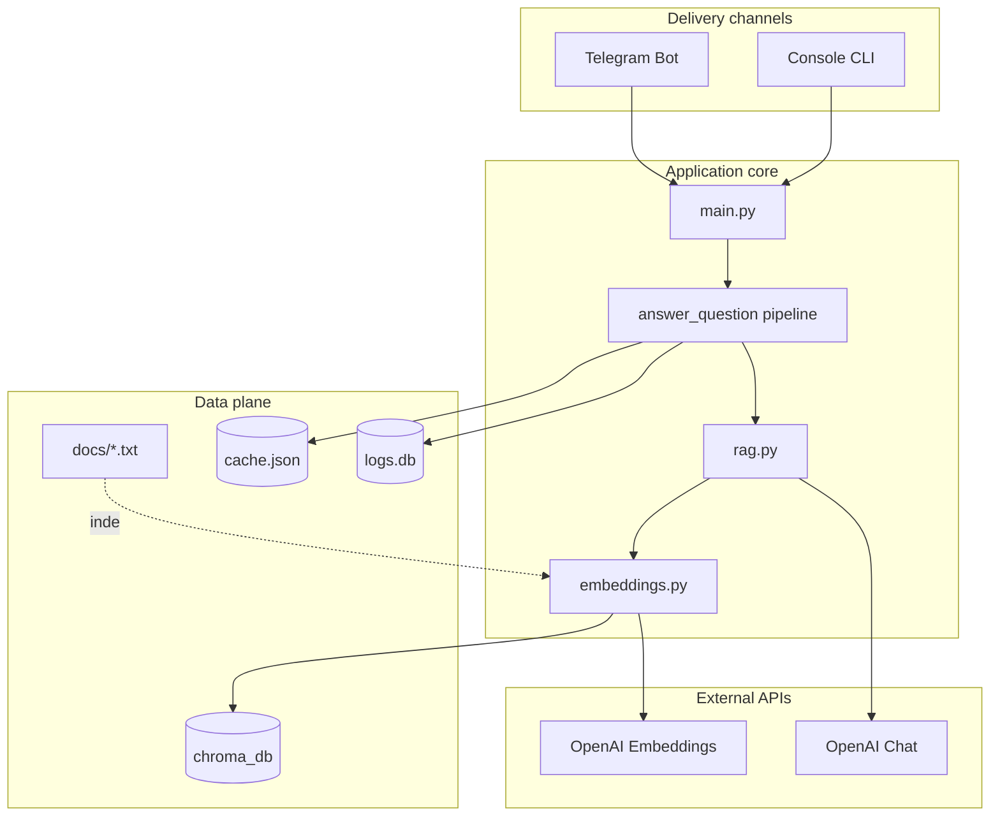

# Пардус-Р AI Consultant — Portfolio

> **Retrieval-Augmented Generation (RAG) assistant** for the portable X-ray device «Пардус-Р» — grounded answers in Russian, delivered via console or Telegram, with caching and full interaction logging.

| | |
|---|---|
| **Role** | End-to-end AI application (Python) |
| **Domain** | Medical equipment / product support |
| **Stack** | Python · OpenAI · ChromaDB · Telegram · SQLite |
| **Repo** | [RAG--ChromaDB-](https://github.com/julipel/RAG--ChromaDB-) |

---

## Table of contents

1. [Business description](#business-description)
2. [Problem and solution](#problem-and-solution)
3. [Features](#features)
4. [Architecture](#architecture)
5. [Screenshots](#screenshots)
6. [Deployment](#deployment)
7. [Results and metrics](#results-and-metrics)
8. [Technical documentation](#technical-documentation)

---

## Business description

### Product context

**«Пардус-Р»** is a portable X-ray system used in field and clinical settings. Sales teams, clinicians, and support staff need fast, consistent answers about:

- technical specifications and kit contents,
- safe operating modes and radiation calculations,
- regulatory registration (КТРУ),
- use cases and competitive positioning.

Traditional support channels (manuals, email, phone) do not scale and are hard to search under time pressure.

### What this project delivers

An **AI product consultant** that:

- answers in **Russian**, aligned with official product documentation,
- **grounds** every answer in a curated knowledge base (`docs/`), reducing hallucination risk,
- runs as a **Telegram bot** for mobile-first users or in **console mode** for demos and QA,
- **caches** frequent questions to cut API cost and latency,
- **logs** every interaction for analytics and compliance review.

### Target users

| Persona | Typical need |
|---------|----------------|
| Field sales / distributors | Specs, kit, differentiation vs competitors |
| Clinicians / operators | Safe mode, exposure calculations, usage scenarios |
| Internal support | Repeatable answers, exportable conversation logs |
| Engineering / product | Demo environment, knowledge-base updates |

### Business value

| Benefit | Mechanism |
|---------|-----------|
| Faster time-to-answer | Semantic search + single-turn Q&A |
| Lower support load | Self-service via Telegram |
| Consistent messaging | Shared `docs/` corpus and RAG prompts |
| Cost control | SHA-256 response cache on identical questions |
| Auditability | SQLite logs + CSV export per user |

---

## Problem and solution



**Problem:** Product knowledge is fragmented across text files; users cannot keyword-search conceptual questions (“как рассчитать безопасный режим?”).

**Solution:** Chunk documents → embed with OpenAI → store in ChromaDB → retrieve top-3 relevant passages → generate answer with `gpt-3.5-turbo` and a Russian, context-only system prompt.

---

## Features

### Core capabilities

| Feature | Description |
|---------|-------------|
| **RAG Q&A** | Retrieves relevant chunks, then generates an answer constrained to that context |
| **Knowledge base** | 8 UTF-8 `.txt` documents covering specs, safety, kit, registration, examples |
| **Persistent vectors** | ChromaDB on disk (`chroma_db/`) survives restarts |
| **Response cache** | Normalized query hashing; `cache.json` persistence between runs |
| **Interaction logging** | SQLite `logs.db`: query, response, user, source, cache hit, latency |
| **CSV export** | Per-user or full log export (console command or Telegram `/logs`) |
| **Multi-channel UI** | Interactive console, demo script, Telegram long-polling bot |

### Telegram bot

| Command | Audience | Purpose |
|---------|----------|---------|
| `/start` | End user | Onboarding message |
| `/help` | End user | Usage guide and sample questions |
| `/stats` | Operator | System stats (docs count, cache, log aggregates) |
| Free text | End user | RAG answer (split if &gt; 4000 chars) |

### Console (developer / demo)

| Command | Purpose |
|---------|---------|
| `cache` | Show cache entry count |
| `clear_cache` | Invalidate cached answers |
| `stats` | Chroma + cache + log statistics |
| `logs` | Export console interactions to CSV |

### Knowledge topics covered (corpus)

- Capabilities and advantages  
- Safety conclusions and recommendations  
- System kit and components  
- Product concept and uniqueness  
- Usage examples  
- Safe operating mode calculations  
- Registration number and КТРУ  
- Technical parameters  

---

## Architecture

### System context



### Request pipeline

1. **Cache lookup** — normalized SHA-256 key; return immediately on hit.  
2. **Retrieval** — embed query (`text-embedding-3-small`), query ChromaDB (`top_k=3`).  
3. **Generation** — Russian prompt with document context → `gpt-3.5-turbo` (max 500 tokens).  
4. **Cache write** — store answer in `cache.json`.  
5. **Audit log** — insert row with `source`, `user_id`, `from_cache`, `response_time_ms`.

### Module map

| Module | Responsibility |
|--------|----------------|
| `main.py` | Bootstrap, mode selection, shared `answer_question()` |
| `embeddings.py` | Chunking (500 / 50 overlap), embeddings, ChromaDB I/O |
| `rag.py` | Prompt template, OpenAI chat completion |
| `cache.py` | JSON-backed response cache |
| `db_logger.py` | SQLite schema, stats, CSV export |
| `telegram_bot.py` | Async handlers, message splitting |
| `vector_store.py` | Facade (optional; not wired in entrypoint) |

### Design decisions

| Decision | Rationale |
|----------|-----------|
| ChromaDB local persistence | No extra infra for MVP; simple backup = copy folder |
| OpenAI embeddings + chat | Strong Russian semantic search; fast to integrate |
| File cache vs Redis | Single-instance bot; minimal ops |
| Character-based chunking | Simple; token-based chunking planned in roadmap |
| Monolith | One process for demos and small deployments |

Deep dive: [ARCHITECTURE.md](./ARCHITECTURE.md)

---

## Screenshots

Replace SVG placeholders below with PNG captures when available (see [docs/screenshots/README.md](./docs/screenshots/README.md)). Suggested filenames are noted under each image.

### Hero — system overview


*Placeholder · Target file: `docs/screenshots/01-hero-overview.png` · Capture: high-level diagram or split view of Telegram + console + ChromaDB.*

---

### Telegram — welcome and help


*Placeholder · Target: `02-telegram-help.png` · Capture: BotFather bot chat showing `/start` and `/help` responses.*

---

### Telegram — RAG conversation


*Placeholder · Target: `03-telegram-qa.png` · Capture: user question about specs or safety + assistant reply.*

---

### Console — interactive session


*Placeholder · Target: `04-console-interactive.png` · Capture: `python main.py` mode 1 with question, retrieval log, and answer.*

---

### Console — statistics


*Placeholder · Target: `05-console-stats.png` · Capture: `stats` command showing Chroma count, cache size, log aggregates.*

---

### Operations — logs export


*Placeholder · Target: `06-logs-export.png` · Capture: `/logs` document in Telegram or `logs_export.csv` opened in a spreadsheet.*

---

## Deployment

### Quick start (development)

```bash
git clone https://github.com/julipel/RAG--ChromaDB-.git
cd RAG--ChromaDB-
python3 -m venv .venv && source .venv/bin/activate
pip install -r requirements.txt pysqlite3-binary
cp env.example .env   # set OPENAI_API_KEY, optional TELEGRAM_BOT_TOKEN
python main.py
```

On first run with an empty `chroma_db/`, all `docs/*.txt` files are indexed automatically.

### Runtime modes

| Mode | Selection | Use case |
|------|-----------|----------|
| Interactive | `1` | Development, manual QA |
| Demo | `2` | Portfolio video, stakeholder demo |
| Telegram | `3` | Production user channel |

### Production checklist

- [ ] Python 3.11+ on VPS or container  
- [ ] `pysqlite3-binary` installed (ChromaDB SQLite compatibility)  
- [ ] `.env` permissions `600`; secrets not in git  
- [ ] Persistent volumes for `chroma_db/`, `cache.json`, `logs.db`  
- [ ] `systemd` unit or Docker with restart policy (see [DEPLOYMENT.md](./DEPLOYMENT.md))  
- [ ] OpenAI usage alerts configured  

### Infrastructure (typical)

```text
┌─────────────────────────────────────┐
│  VPS / Docker host                  │
│  ┌───────────────────────────────┐│
│  │ python main.py (Telegram mode) ││
│  │  ├─ chroma_db/                ││
│  │  ├─ cache.json                 ││
│  │  └─ logs.db                    ││
│  └───────────────────────────────┘│
└──────────────┬──────────────────────┘
               │ HTTPS
       ┌───────┴────────┐
       ▼                ▼
  OpenAI API      Telegram API
```

Full guide: [DEPLOYMENT.md](./DEPLOYMENT.md)

---

## Results and metrics

*Illustrative targets for portfolio narrative — replace with real numbers from `logs.db` / OpenAI dashboard after deployment.*

| Metric | Example direction |
|--------|-------------------|
| Cache hit rate | Increases as FAQ questions repeat |
| Avg response time (cache hit) | Sub-second (local + JSON read) |
| Avg response time (cache miss) | 2–8 s (embed + chat + network) |
| Knowledge chunks indexed | ~N chunks from 8 source documents |
| Languages | Russian (prompt + corpus) |

**Qualitative outcomes:** consistent product messaging, 24/7 self-service, exportable audit trail for support quality review.

---

## Technical documentation

| Document | Contents |
|----------|----------|
| [README.md](./README.md) | Quick start (RU), commands, security |
| [ARCHITECTURE.md](./ARCHITECTURE.md) | Detailed design, schemas, security notes |
| [DEPLOYMENT.md](./DEPLOYMENT.md) | systemd, Docker recipe, troubleshooting |
| [ROADMAP.md](./ROADMAP.md) | Phased improvements (FastAPI, Docker, tests) |
| [docs/screenshots/README.md](./docs/screenshots/README.md) | How to capture and replace placeholders |

---

## Author note (portfolio)

This project demonstrates **production-oriented AI engineering**: not only calling an LLM, but building retrieval, caching, observability, and a user-facing channel. Suitable for roles in **AI automation**, **LLM application development**, and **technical product support tooling**.

**Skills highlighted:** RAG · vector databases · prompt design · Telegram bots · Python · SQLite · API cost optimization · technical documentation.

---

*Last updated: May 2026*
